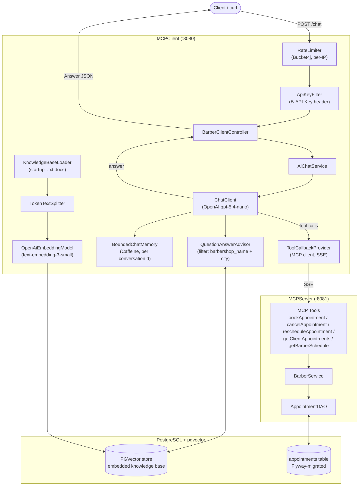

# Barbershop AI Consultant

An AI-powered REST API chatbot for a barbershop that answers questions
about services, pricing, and availability by pulling responses from a
real knowledge base (txt files) instead of making things up.
Also handles appointment booking stored in PostgreSQL.


## Architecture

Two modules that run independently:

- MCPServer — exposes the barbershop knowledge base and booking
  logic via Model Context Protocol (MCP).
  Tools: `bookAppointment`, `rescheduleAppointment`, `cancelAppointment`, `getClientAppointments`, `getBarberSchedule`.

- MCPClient — Spring Boot REST API, handles user queries,
  retrieves context via RAG (PGVector), filtered per-barbershop from metadata, calls OpenAI to generate responses.
  Requests are rate-limited per client IP and require an API key (`B-API-Key` header). Chat history is kept
  per `conversationId` in a bounded in-memory cache (Caffeine, evicted after 1h / max conversations).



## Tech Stack
Java 21, Spring Boot 4.1.0, Spring AI 2.0, OpenAI API, RAG, MCP, PostgreSQL, Bucket4j, Caffeine, Gradle

## How to Run

**0. Create `.env` file in project root**
```env
OPENAI_API_KEY=your-key-here
POSTGRES_URL=your-url-here
POSTGRES_USERNAME=your-username-here
POSTGRES_PASSWORD=your-password-here
BARBERSHOP_API_KEY=your-api-key-here
```

You can also find `.env.example` file in project root

**1. Build and start**
```bash
./start.sh
```

or just straight

```powershell
./gradlew bootJar; docker compose up -d --build
```

**2. Send a query**

Every request needs a `B-API-Key` header (matching `BARBERSHOP_API_KEY`) and a `conversationId`
(a UUID, used to keep chat history scoped per conversation).

```bash
curl -X POST http://localhost:8080/chat \
  -H "Content-Type: application/json" \
  -H "B-API-Key: your-api-key-here" \
  -d '{
        "conversationId": "3fa85f64-5717-4562-b3fc-2c963f66afa6",
        "question": "Can you list staff that works in this barbershop?",
        "barbershopName": "STARY_CYRULIK",
        "barbershopCity": "Gdansk"
      }'
```

## Why RAG?
Without RAG, the model would hallucinate barbershop-specific details
(pricing, services, hours). RAG ensures every answer is taken from knowledge base (txt files in my case)
